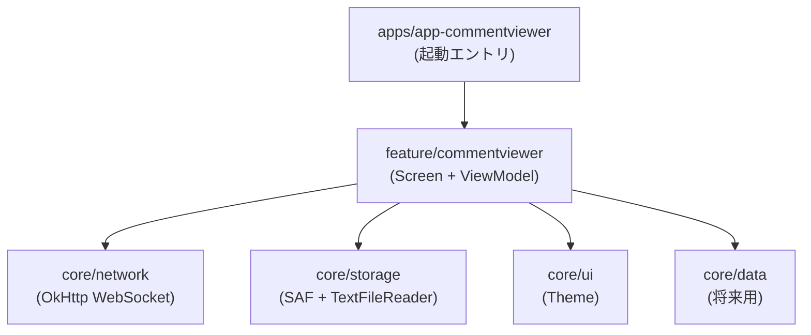
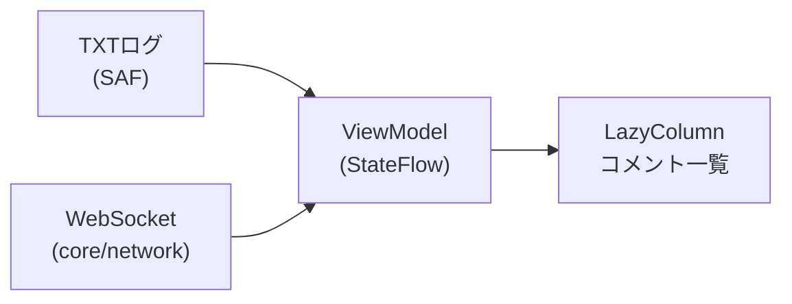
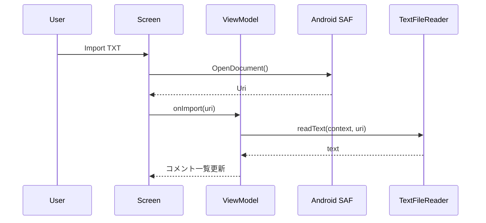
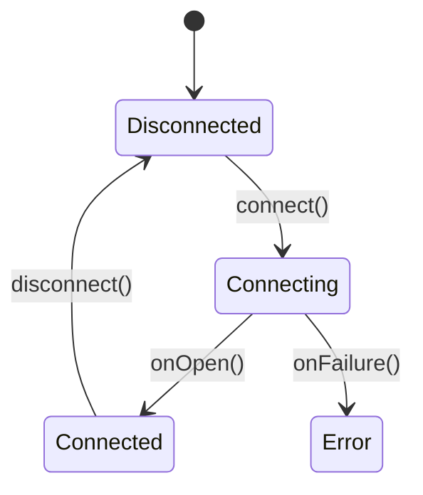

---

# 📦 CommentViewer 母艦 v0.1

配信コメントビューアの母艦アプリ。
TXTログ再生と WebSocket リアルタイムコメントを統合表示する基盤。

```diff
+ WebSocket テストURLはエミュレータ用（ws://10.0.2.2:8080）

```

---

## 🧱 アーキテクチャ概要



### アーキテクチャ方針

* UI とデータ取得ロジックを分離（MVVM）
* WebSocket / SAF を core レイヤに隔離
* ViewModel は StateFlow で単方向データフローを提供
* 将来の YouTube / OBS 連携を考慮した拡張可能設計

---

## 🔄 データ統合フロー

TXTログと WebSocket を単一ストリームとして UI に反映。



---
🔗 データ統合アーキテクチャ（I/Oブリッジ）
## 🔗 データ統合アーキテクチャ（I/Oブリッジ）

```mermaid
flowchart LR
  subgraph External
    TXT["TXT Log (SAF)"]
    WS["WebSocket Server"]
    YT["YouTube Live (planned)"]
  end

  subgraph Core
    STORAGE["core/storage\nTextFileReader"]
    NETWORK["core/network\nWebSocketClient"]
    DATA["core/data\nRoom / DataStore (planned)"]
  end

  subgraph Feature
    VM["ViewModel\nStateFlow\nIntegration Hub"]
  end

  subgraph UI
    SCREEN["LazyColumn\nComment List"]
  end

  TXT --> STORAGE --> VM
  WS --> NETWORK --> VM
  YT -.-> NETWORK

  VM --> SCREEN
  VM --> DATA
---

## 📊 対応データソース

| ソース          | 状態 | 実装                  |
| ------------ | -- | ------------------- |
| TXTログ        | ✅  | SAF                 |
| WebSocket    | ✅  | OkHttp              |
| YouTube Live | ⏳  | 予定                  |
| 永続化          | ⏳  | Room / DataStore 予定 |

---

## 📡 WebSocket フロー

```mermaid
sequenceDiagram
  participant U as User
  participant UI as Screen
  participant VM as ViewModel
  participant WS as WebSocketClient
  participant S as WS Server

  U->>UI: Connect
  UI->>VM: connect(url)
  VM->>WS: connect(url)
  WS->>S: handshake
  S-->>WS: connected
  WS-->>VM: onOpen()
  VM-->>UI: state=Connected

  S-->>WS: message(text)
  WS-->>VM: onMessage(text)
  VM-->>UI: コメント追加

  U->>UI: Send
  UI->>VM: send(text)
  VM->>WS: send(text)
```

---

## 📂 SAF TXT 読み込みフロー



---

## 📊 接続状態（WsState）



---

## 🧩 モジュール構成

* `core/network` : WebSocket クライアント雛形
* `core/storage` : SAF + TextFileReader
* `core/ui` : 共通Theme
* `core/data` : 将来用データ層
* `feature/commentviewer` : Screen + ViewModel
* `apps/app-commentviewer` : 起動エントリ

---

## ✅ 実装済み

* SAF による TXT ファイル読み込み（Import TXT）
* WebSocket 接続 / 送信 / 受信（OkHttp）
* ViewModel + StateFlow によるコメント一覧表示
* LazyColumn でリアルタイム更新

---

## 🧪 動作確認

1. アプリ起動
2. **Import TXT** → ファイル選択 → 内容がコメント一覧に表示
3. **WebSocket Connect** → メッセージ受信で一覧に追加
4. **Send** ボタンで送信可能

---

## ⚠️ 現在の制限

* コメントの永続化は未実装（メモリ保持のみ）
* WebSocket 再接続ロジックは簡易版
* 大量ログ時の仮想化最適化は未対応

---

## 🗺️ 今後の予定

* YouTube Live Chat 連携
* コメントのローカル保存（Room / DataStore）
* OBS オーバーレイ出力
* 接続状態の UI 表示強化

---

## 🛠️ セットアップ

1. リポジトリをクローン
2. Run 構成を `app-commentviewer` に設定
3. Android Emulator 起動
4. ローカル WebSocket サーバを起動

### ローカル WebSocket テストサーバ

```text
ws://10.0.2.2:8080
```

---

## 🔗 参考リンク

* [Android SAF ドキュメント](https://developer.android.com/training/data-storage/shared/documents-files)
* [OkHttp WebSocket](https://square.github.io/okhttp/)
* [StateFlow](https://developer.android.com/kotlin/flow/stateflow-and-sharedflow)
* [LazyColumn](https://developer.android.com/jetpack/compose/lists)

---

## 🎯 目的

配信コメントビューア母艦として
TXTログ再生 + リアルタイムコメント統合 を行う基盤。

---
